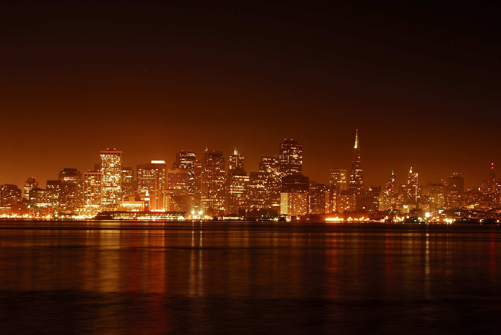
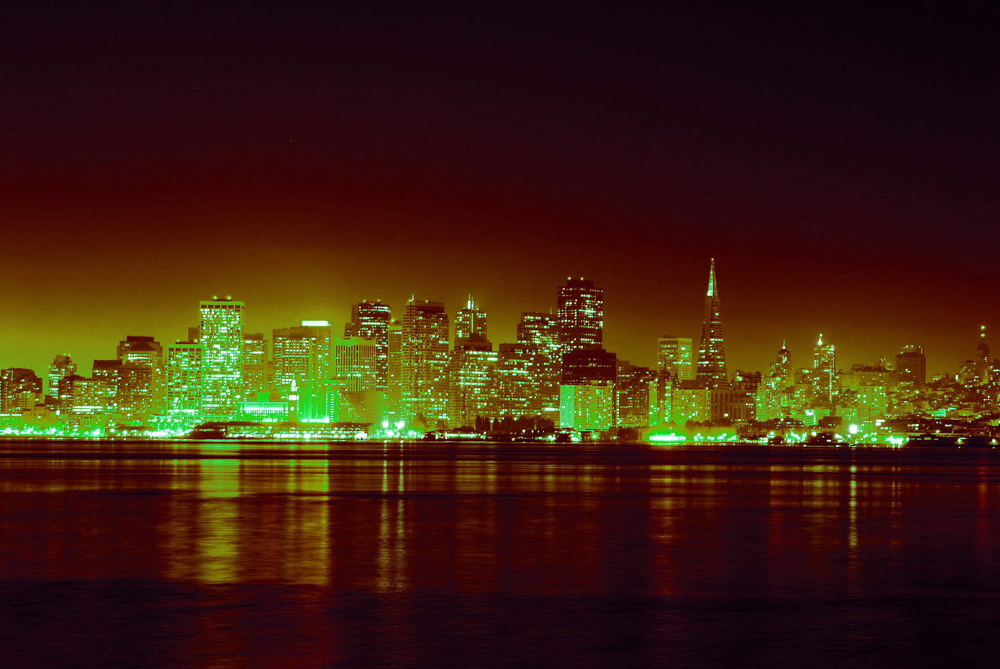
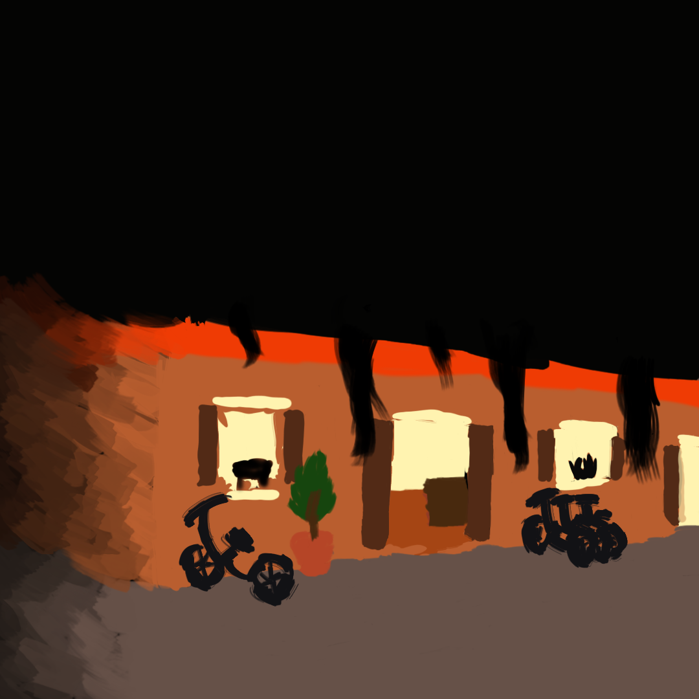
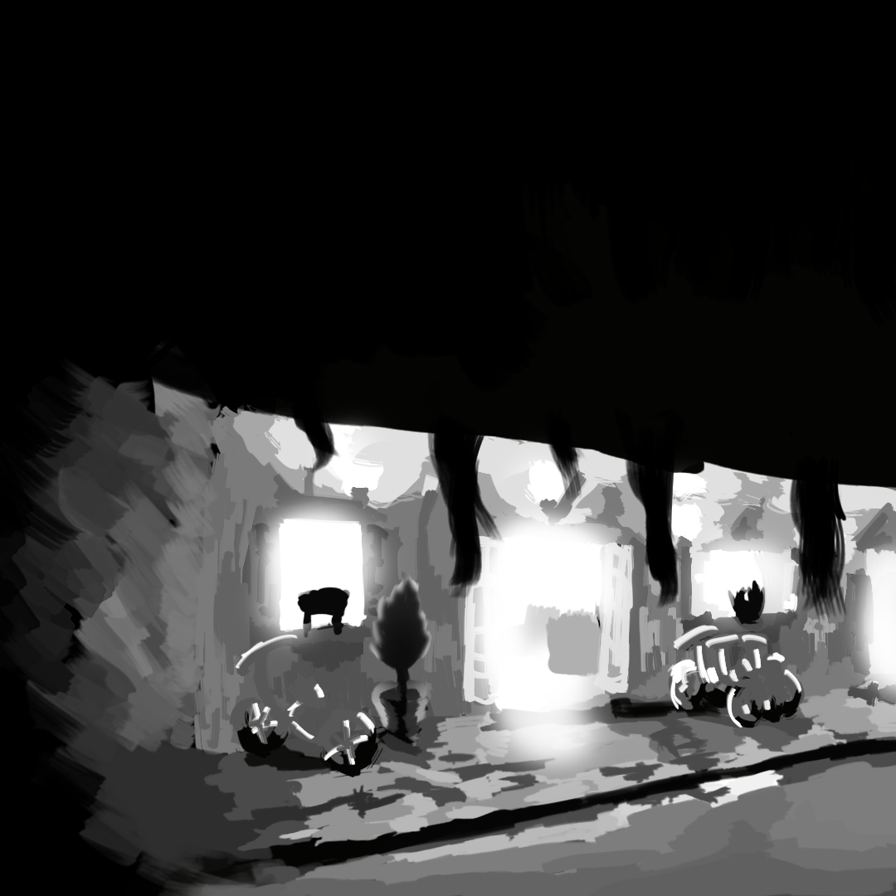
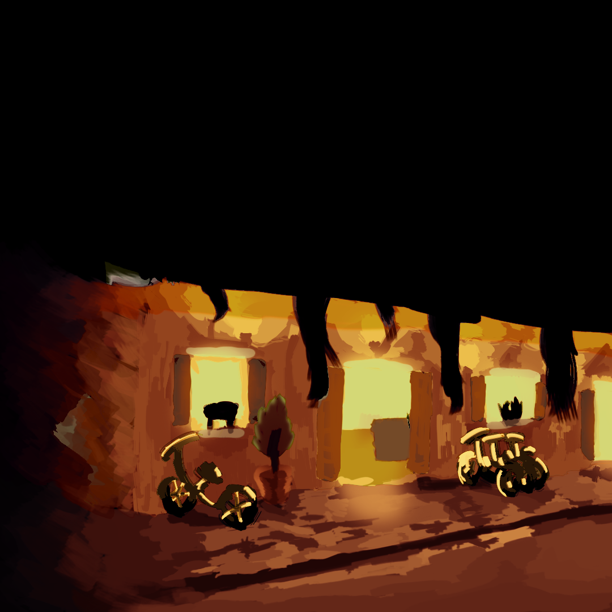

# Colorfold
Filtering algorithm for putting an image into a certain palette.

# Method
Colors are represented as 3D spaces and this algorithm takes advantage of that structure. The program takes in a "Folding Machine" represented in JSON which describes a set of rotations and scalings to apply to the input image and then average together. These rotations can be defined as the rotation from a static point to another static point or some geometric object to another. Additionally, one can use multiple input images and choose the rotations based on some component of those other input images. The basic intuition behind this process is the "Folding Machine" creates a mapping from the "start" color of a rotation to the "end" color. The rest of the colors are mapped similarly.


TODO: Link to more technical overview.

# Building

This project can target mutiple different graphics backend depending on your system (although it has only been tested on mac). When building you must use ```cargo build --features [backend]``` where backend is ```metal``` for Mac, ```dx12``` for windows and ```vulkan``` for not Mac. Additionally, your gpu must support compute shaders.

## Running

To run this program you must construct a JSON file specifying a "Folding Machine" (TODO: Write up the syntax for this) and pass the path to the file as an argument. You can specify multiple files and it will filter all of them.

# Examples

## Filtering a flower on red and green.

==>


## Filtering a fly on saturation.

==>


## Creating a radio active city.

==>


## Combining color and lighting.
 + 
==>

